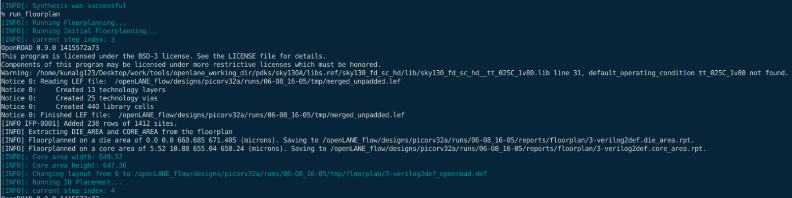
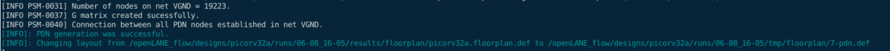
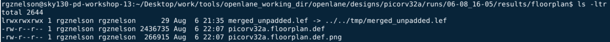
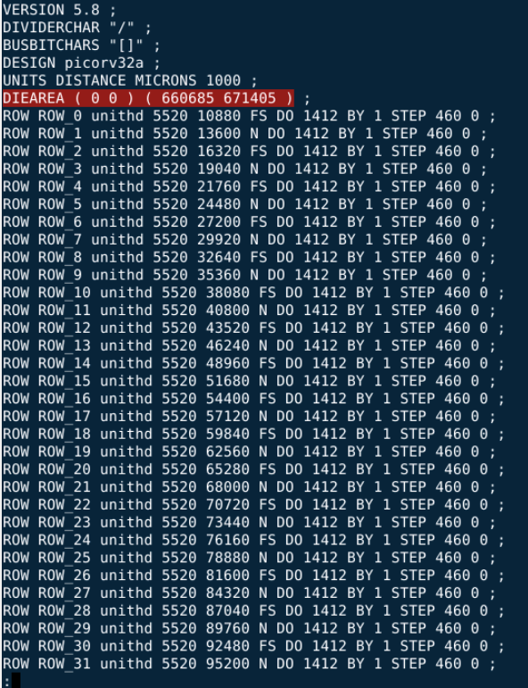
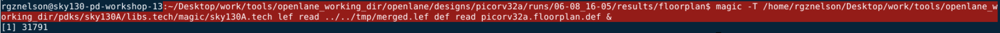
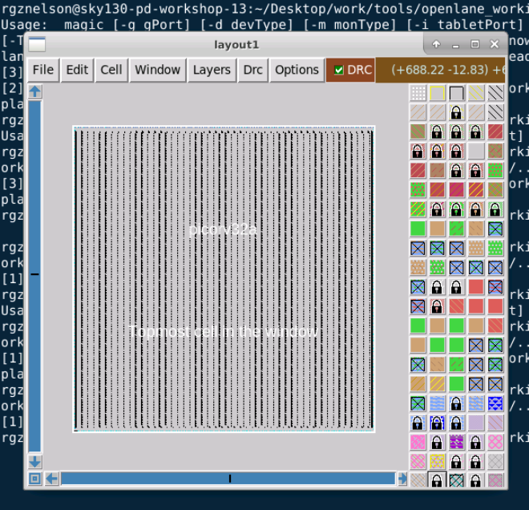

# Advanced Physical Design Using OpenLane - Sky130 

Summary of all commands
~~~ Bash
# Day 1
cd ~/Desktop/work/tools/openlane_working_dir/openlane
docker
./flow.tcl -interactive
package require openlae 0.9
prep -design picorv32a
run_synthesis

#Day 2
# Docker session
run_floorplan
# Another window
cd ~/Desktop/work/tools/openlane_working_dir/openlane/designs/picorv32a/runs/07-08_12-15/results/floorplan
magic -T /home/rgznelson/Desktop/work/tools/openlane_working_dir/pdks/sky130A/libs.tech/magic/sky130A.tech lef read ../../temp/merged.lef def read picorv32a.floorplan.def

#Docker session
run_placement
# Another windows
cd ~/Desktop/work/tools/openlane_working_dir/openlane/designs/picorv32a/runs/07-08_12-15/results/placement
magic -T /home/rgznelson/Desktop/work/tools/openlane_working_dir/pdks/sky130A/libs.tech/magic/sky130A.tech lef read ../../tmp/merged.lef def read picorv32a.placement.def &
~~~


## Day 1. Inception of Open-Source EDA, OpenLANE and Sky130 PDK

~~~ bash
$ cd ~/Desktop/work/tools/openlane_working_dir/openlane
$ docker
$ ./flow.tcl -interactive
$ package require openlae 0.9
$ prep -design picorv32a
$ run_synthesis
~~~

![[vsd @ Preparation.png]]
![[vsd @ Synthesis.png]]
![[vsd @ synthesis-2.png]]

We calculate the flop ratio which is equal to dfxtp_2 / cells.
Then flop ratio = 1613/14876 = 0.10842 =>10.842%

## Day 2. Good Floorplan vs Bad Floorplan and Introduction to Library Cells

### Floorplanning

#### Theory
- **Floorplanning**
	- **What is?** Arrangement of pins, logical blocks and library cells in the chip.
	- **Why?** To minimize area, timing, wire length.
	- **If good?** Facilitates implementation (place, cts, route, timing closure).
	- **If bad?** Congestion, timing, noise, routing issues.
	- **How?** 
		- Every module has been assigned an appropriate area and aspect ratio.
		- Every pin of the module has connection with other modules or periphery of the chip.
		- Modules are arranged in a way such that it consumes lesser area on chip.
- **What is utilization factor?** Ratio [core area used by standard cells] /  [core area]
- **What is aspect ratio?** Ratio [height] / [width] of a module.
- **Power planning**
	- **What is?** Creation of a power grid to distribute equally the power across chip.
	- **Why?** To connect power to the chip dealing with unwanted voltage drop and ground bounce.
- **Pin placement**
	- **What is?** Locations of the chip pins.
	- **Why?** Buffers required and timing delays depends on position of pins.


#### Run 
To perform the floorplanning with OpenLANE we just need to run `run_placement` command within the docker session.


...


**Output files?**
-  .def
- .lef  (not used)
- .png



**File content?**
- Die area (a b) (c d)
- Placement of standard cells.



#### Explore


#### Verification
To perform the verification, we open a new terminal tab and use **Magic Layout Tool** which allows us to visualize the layout after floorplan. To view it we need three files:
1. DEF file ( `picorv32a.floorplan.def` )
2. LEF file ( `merged.lef` ) 
3. Technology file ( `sky130A.tech` )



 

---

### Placement
#### Theory
- **Placement**
	- **What is?** Placing standard cells in the die.
	- **How?** Using algorithms driven by timing, congestion and optimization criteria 

#### Run
~~~ bash
# Docker session
run_placement
~~~

#### Explore

#### Verification
~~~ bash
# Another windows
cd ~/Desktop/work/tools/openlane_working_dir/openlane/designs/picorv32a/runs/07-08_12-15/results/placement
magic -T /home/rgznelson/Desktop/work/tools/openlane_working_dir/pdks/sky130A/libs.tech/magic/sky130A.tech lef read ../../tmp/merged.lef def read picorv32a.placement.def &
~~~


---
### Cell Design and Characterization Flow
#### TheoRy
- **Inputs?**
	- PDK
	- DRC & LVS rules (lambda rules from technology)
	- SPICE models
	- Library and user defined specifications (cell height, width, power supply)
- **Circuit design steps?**
	- Circuit design 
	- Layout design
	- Characterization

## Day 3. Design Library Cell Using Magic Layout and Ngspice Characterization

![[ATTACHMENTS/flow-day1]]

### Theory

### Run
We will practice how to simulate and modify spice files. First we need to clone the inverter design from this repository.


Once we have it, we use magic to open it and extract its netlist using following commands:
~~~ tk
extract all
ext2spice cthresh 0 rthresh 0
ext2spice
~~~


Thanks to those commands we get this netlist. Now we need to modify it adding voltage source and including the models of transistors and at the end a control section to create the simulation.


The modified file must have this content. You can use the vi editor to do the respective changes from terminal.
~~~
.option scale=0.01u
.include ./libs/pshort.lib
.include ./libs/nshort.lib

//.subckt sky130_inv A Y VPWR GND
M0 Y A VGND VGND nshort_model.0 ad=1443 pd=152 as=1517 ps=156 w=35 l=23
M1 Y A VPWR VPWR pshort_model.0 ad=1443 pd=152 as=1517 ps=148 w=37 l=23
VDD VPWR 0 3.3V
VSS VGND 0 0V
Va A VGND PULSE(0V 3.3V 0 0.1ns 0.1ns 2ns 4ns)
C0 A Y 0.05fF
C1 Y VPWR 0.11fF
C2 A VPWR 0.07fF
C3 Y VGND 0.24fF
C4 VPWR VGND 0.59fF
//.ends

.tran 1n 20n

.control
run
.endc
.end
~~~

Now we use the command ngspice to simulate. Ngspice is the open source tool to simulate circuits and this is compatible with many different spice formats (hspice, ltspice, spice3, etc).


### Verification

To check that this is indeed an inverter we plot the output and input through the time, doing: `plot y vs time a` 
We get next graph wich allows us to verify that this inverter is working correctly.


## Day 4. Pre-layout Timing Analysis and Importance of Good Clock Tree
[4.1 Standard Cell Creation](README#Standard%20Cell%20Creation)
[4.2 Modification of Library](README#Modification%20of%20Library)
[4.2 Again Synthesis-Floorplanning-Placement](README#Again%20Synthesis-Floorplanning-Placement)


### Standard Cell Creation

### Run

**What are going to do?**
- [ ] Charge Nickson's inverter
- [ ] Set the grid
- [ ] Save inverter as new file
- [ ] Generate LEF file

Change the grid by typing `grid 0.46um 0.34um 0.23um 0.17um` and save this inverter with a new nave, let's say `sky130_vsdinv.mag`


To this new inverter let's generate the LEF file, typing in the console `lef write`.


### Modification of Library

### Run

> **What are we going to do?**
> - [ ] Copy the LEF file of the new inverter into the src folder of the **picorv32** design.
> - [ ] Copy cell libraries used in the inverter (given by Nickson's repo) to the src folder of the **picorv32** design.
> - [ ] Configure the `config.tcl` file


Let's copy both the inverter LEF file and libraries used by this inverter into the `picorv32a/src/` folder:


Now it's time to add libraries into the `config.tcl`file. Your file must be like this:

~~~ 
# Design
set ::env(DESIGN_NAME) "picorv32a"

set ::env(VERILOG_FILES) "./designs/picorv32a/src/picorv32a.v"
set ::env(SDC_FILE) "./designs/picorv32a/src/picorv32a.sdc"

set ::env(CLOCK_PERIOD) "5.000"
set ::env(CLOCK_PORT) "clk"

set ::env(CLOCK_NET) $::env(CLOCK_PORT)

set ::env(LIB_SYNTH) "$::env(OPENLANE_ROOT)/designs/picorv32a/src/sky130_fd_sc_hd__typical.lib"
set ::env(LIB_FASTEST) "$::env(OPENLANE_ROOT)/designs/picorv32a/src/sky130_fd_sc_hd__fast.lib"
set ::env(LIB_SLOWEST) "$::env(OPENLANE_ROOT)/designs/picorv32a/src/sky130_fd_sc_hd__slow.lib"
set ::env(LIB_TYPICAL) "$::env(OPENLANE_ROOT)/designs/picorv32a/src/sky130_fd_sc_hd__typical.lib"

set ::env(EXTRA_LEFS) [glob $::env(OPENLANE_ROOT)/designs/$::env(DESIGN_NAME)/src/*.lef]

set filename $::env(OPENLANE_ROOT)/designs/$::env(DESIGN_NAME)/$::env(PDK)_$::env(STD_CELL_LIBRARY)_config.tcl
if { [file exists $filename] == 1} {
	source $filename
}
~~~

### Again Synthesis-Floorplanning-Placement

Let's create a docker session and synthesis, floorplan and placement again the design but using the new libraries added.

~~~ bash
# bash terminal
cd ~/Desktop/work/tools/openlane_working_dir/openlane/
docker
./flow.tcl -interactive
package require openlane 0.9
prep -design picorv32a -tag 07-08_12-15 -overwrite
set lefs [glob $::env(DESIGN_DIR)/src/*lef]
add_lefs -src $lefs
# 
~~~


Modifying the next variable we get new values for `tns` and `wns` both equal to zero.

```
set ::env(SYNTH_STRATEGY) "DELAY 0"
```


We could check the number of inverters used and the chip area:


Now we run the floorplanning, placement and routing with these commands:
~~~ bash
init_floorplan
place_io
global_placement_or
detailed_placement
tap_decap_or
detailed_placement
gen_pdn
run_routing
~~~

After `global_placement_or` we get:


After `detailed_placement` we get:


After `run_routing` we get:


### Timing Analysis

